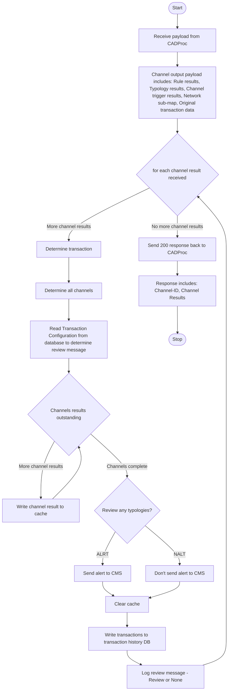

# 5. Transaction Aggregation and Decisioning Processor (TADP)

The sequence diagram below for the Transaction Aggregation and Decisioning Processor

## Overview

### Services

- [ArangoDB](https://arangodb.com/): Database Management
- [NATS](https://nats.io): Message queue

You also need NodeJS to be installed in your system. The current [LTS](https://nodejs.org/en) should be suitable. Please open an issue if the application fails to build on the current LTS version. Unix platforms, you should be able to find `nodejs` in your package manager's repositories.

#### Setting Up

```sh
git clone transaction-aggregation-decisioning-processor
cd transaction-aggregation-decisioning-processor
```
You then need to configure your environment: a [sample](.env.template) configuration file has been provided and you may adapt that to your environment. Copy it to `.env` and modify as needed:

```sh
cp .env.template .env
```
A [registry](https://github.com/frmscoe/docs) of environment variables is provided to provide more context for what each variable is used for.

#### Build and Start

```sh
npm i
npm run build
npm run start
```
## Inputs

```js
{
  typologyResult: TypologyResult; // https://raw.githubusercontent.com/frmscoe/frms-coe-lib/46d1ec1fc9a07b6556baa4fecd80e09c709ccb1b/src/interfaces/processor-files/TypologyResult.ts
  transaction: Pacs002; // https://raw.githubusercontent.com/frmscoe/frms-coe-lib/cb464248be1efc45ba2701131e75fcf89c478baf/src/interfaces/Pacs.002.001.12.ts
  networkMap: NetworkMap; // https://raw.githubusercontent.com/frmscoe/frms-coe-lib/aad0f12d07a82dd948fa9d8033f96e9bf8cb3dde/src/interfaces/NetworkMap.ts
  metaData?: {
    prcgTmDp: number;
    prcgTmCRSP: number;
}
```
Where the `transaction` is described as a `Pacs002` message defined [here](https://github.com/frmscoe/frms-coe-lib/blob/dev/src/interfaces/Pacs.002.001.12.ts)

### Code Activity Diagram



## Outputs
The output is the input with an added [tadpResult](https://github.com/frmscoe/frms-coe-lib/blob/dev/src/interfaces/processor-files/TADPResult.ts):

```js
{
  typologyResult: TypologyResult; // https://raw.githubusercontent.com/frmscoe/frms-coe-lib/46d1ec1fc9a07b6556baa4fecd80e09c709ccb1b/src/interfaces/processor-files/TypologyResult.ts
  transaction: Pacs002; // https://raw.githubusercontent.com/frmscoe/frms-coe-lib/cb464248be1efc45ba2701131e75fcf89c478baf/src/interfaces/Pacs.002.001.12.ts
  networkMap: NetworkMap; // https://raw.githubusercontent.com/frmscoe/frms-coe-lib/aad0f12d07a82dd948fa9d8033f96e9bf8cb3dde/src/interfaces/NetworkMap.ts
  metaData?: {
    prcgTmDp: number;
    prcgTmCRSP: number;
  },
  tadpResult: TADPResult;
}
```

## Environment Variables

You then need to configure your environment: a [sample](.env.template) configuration file has been provided and you may adapt that to your environment. Copy it to `.env` and modify as needed:

```sh
cp .env.template .env
```
A [registry](https://github.com/frmscoe/docs) of environment variables is provided to provide more context for what each variable is used for.

##### Additional Variables
| Name                                    | Purpose                                     | Example                   |
|-----------------------------------------|---------------------------------------------|---------------------------|
| `TRANSACTION_HISTORY_DATABASE_CERT_PATH` | Certificate path for transaction history database |                           |
| `TRANSACTION_HISTORY_DATABASE_URL`      | URL for transaction history database        | `http://localhost:8529`   |
| `TRANSACTION_HISTORY_DATABASE_USER`     | User for transaction history database       | `root`                    |
| `TRANSACTION_HISTORY_DATABASE_PASSWORD` | Password for transaction history database   | `secret`                  |
| `TRANSACTION_HISTORY_DATABASE`          | Database name for transaction history       | `transactionHistory`      |
| `NETWORK_MAP_DATABASE_CERT_PATH`       | Certificate path for network map database   | `/path/to/cert`           |
| `NETWORK_MAP_DATABASE_URL`             | URL for network map database                | `http://localhost:8529`   |
| `NETWORK_MAP_DATABASE_USER`            | User for network map database               | `root`                    |
| `NETWORK_MAP_DATABASE_PASSWORD`        | Password for network map database           | `password`                |
| `NETWORK_MAP_DATABASE`                 | Database name for network map               | `networkMap`              |
| `CONFIG_DATABASE_CERT_PATH`            | Certificate path for configuration database | `/path/to/cert`           |
| `CONFIG_DATABASE_URL`                  | URL for configuration database              | `http://localhost:8529`   |
| `CONFIG_DATABASE_USER`                 | User for configuration database             | `root`                    |
| `CONFIG_DATABASE_PASSWORD`             | Password for configuration database         | `password`                |
| `CONFIG_DATABASE`                      | Configuration database                      | `Configuration`           |
| `CONFIG_COLLECTION`                    | Collection for configuration database       | `config`                  |
| `TRANSACTION_DATABASE_CERT_PATH`       | Certificate path for transaction database   | `/path/to/cert`           |
| `TRANSACTION_DATABASE_URL`             | URL for transaction database                | `http://localhost:8529`   |
| `TRANSACTION_DATABASE_USER`            | User for transaction database               | `root`                    |
| `TRANSACTION_DATABASE_PASSWORD`        | Password for transaction database           | `password`                |
| `TRANSACTION_DATABASE`                 | Database name for evaluation results        | `evalResults`             |
