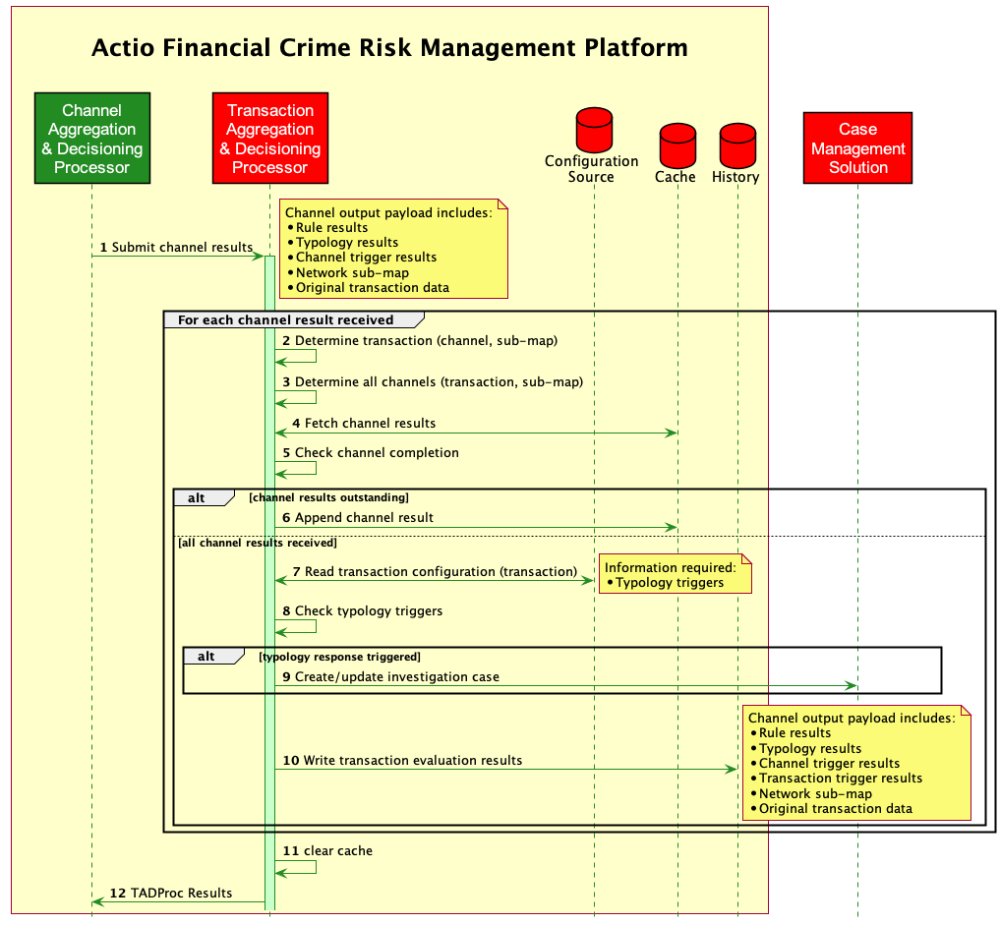
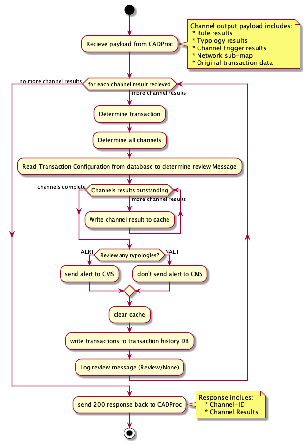

# 5. Transaction Aggregation and Decisioning Processor (TADP)

This page should be a developers guide and include;

1. detail documentation of the service

    1. explain of the service functionality
  
    2. what information is being written to logs (system and transactional)
  
    3. deployment & installation guide
  
    4. sequence diagram focusing on this service
  
The below sequence diagram for the Transaction Aggregation and Decisioning Processor



### Code Activity Diagram




### Sample JSON Request and Response

The requests and corresponding responses below can be simulated using the following Json file in postman.

#### Requests:

[TADP_request_2.json](./TADP_request_2.json)
[TADP_request_1.json](./TADP_request_1.json)

#### Expected Responses:

[TADP_response_2.json](./TADP_response_2.json)
[TADP_response_1.json](./TADP_response_1.json)

## Transaction Configuration Sample

```json
{
  "messages": [
    {
      "id": "001@1.0",
      "cfg": "1.0",
      "txTp": "pain.001.001.11",
      "channels": [
        {
          "id": "001@1.0",
          "cfg": "1.0",
          "typologies": [
            {
              "id": "028@1.0",
              "cfg": "1.0",
              "threshold": 100
            },
            {
              "id": "029@1.0",
              "cfg": "1.0",
              "threshold": 100
            }
          ]
        },
        {
          "id": "002@1.0",
          "cfg": "1.0",
          "typologies": [
            {
              "id": "028@1.0",
              "cfg": "1.0",
              "threshold": 100
            },
            {
              "id": "029@1.0",
              "cfg": "1.0",
              "threshold": 100
            }
          ]
        }
      ]
    },
    {
      "id": "002@1.0",
      "cfg": "1.0",
      "txTp": "pain.013.001.09",
      "channels": [
        {
          "id": "001@1.0",
          "cfg": "1.0",
          "typologies": [
            {
              "id": "028@1.0",
              "cfg": "1.0",
              "threshold": 100
            },
            {
              "id": "029@1.0",
              "cfg": "1.0",
              "threshold": 100
            }
          ]
        },
        {
          "id": "002@1.0",
          "cfg": "1.0",
          "typologies": [
            {
              "id": "028@1.0",
              "cfg": "1.0",
              "threshold": 100
            },
            {
              "id": "029@1.0",
              "cfg": "1.0",
              "threshold": 100
            }
          ]
        }
      ]
    }
  ]
}
