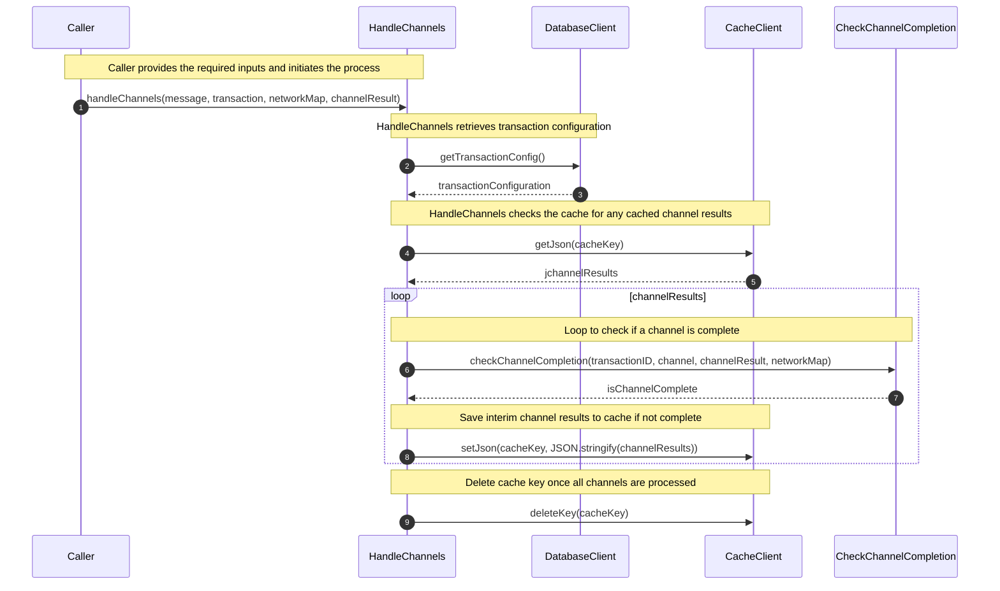

# TADProc

## Overview

Here's a brief explanation of each participant:

1. **Caller**: Initiates the process by providing the required inputs (transaction, network map, and channel result) and calling the handleChannels function.
2. **HandleChannels**: Manages the processing of the channels and calls checkChannelCompletion to verify if a channel is complete.
3. **CheckChannelCompletion**: Determines if a channel is complete by checking the cache for interim results and the network map.
4. **CacheClient**: Manages the caching of interim channel results, providing methods such as getJson, setJson, and deleteKey.
5. **APM**: Monitors the performance of the code execution, starting and ending spans to measure the time taken by different parts of the code.
6. **LoggerService**: Logs various events, messages, and errors that occur during the code execution, helping to track progress and diagnose any issues.
7. **DatabaseClient**: Retrieves transaction configurations from the database to be used during channel evaluation.

## Sequence Diagram

Here's a detailed explanation of the numbers in the sequence diagram:

1. The Caller provides the required inputs and calls the handleChannels function.
2. The handleChannels function retrieves the transaction configuration from the database using the databaseClient.
3. The function then checks the cache for any previously cached channel results.
4. It enters a loop where it checks if a channel is complete by calling the checkChannelCompletion function.
5. If the channel is not complete, the interim channel results are saved to the cache.
6. Once all channels are processed, the cache key is deleted.
